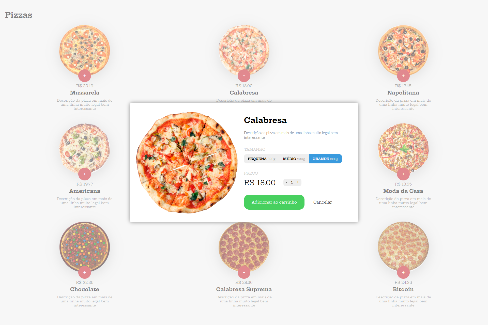
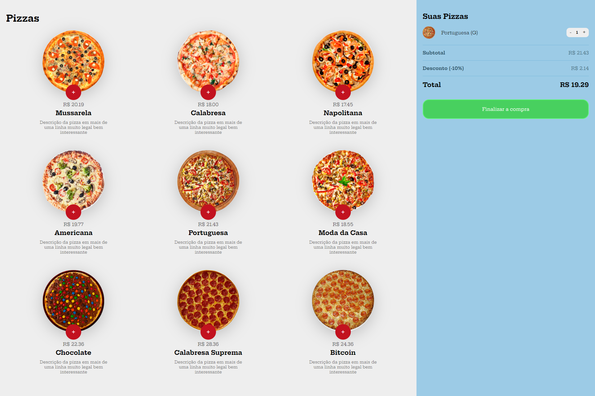

# Projeto de site de pizzaria

O objetivo era criar um site utilizando JS puro e HTML + CSS e por em pratica os conhecimentos adquiridos no curso da <a href="https://alunos.b7web.com.br/"> b7web</a> 

<a href="https://pizzaria-do-diegod.netlify.com/"> Demo </a> 

<h3> Tela principal </h3>

<h3> Tela do modal </h3>

<h3> Tela do carrinho </h3>

