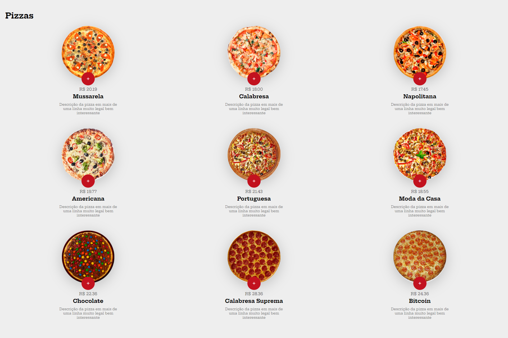

# Projeto de site de pizzaria

O objetivo era criar um site utilizando JS puro e HTML + CSS e por em pratica os conhecimentos adquiridos no curso da <a href="https://alunos.b7web.com.br/"> b7web</a> 

<a href="https://medium.com/@raullesteves/github-como-fazer-um-readme-md-bonit%C3%A3o-c85c8f154f8"> DEMO</a> 

